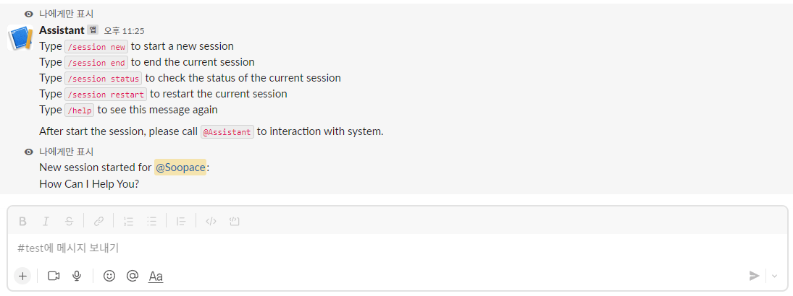
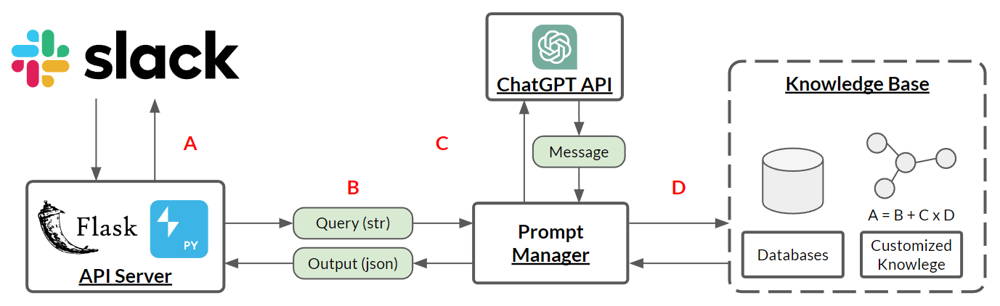

# An Enhanced Interactive System for ChatGPT with Customized Local Knowledge Base

This is a repository for the VLDB 2023 Demo submission.

Youtube Link: [https://youtu.be/wmzXyUYGWKg](https://youtu.be/wmzXyUYGWKg)

<br>

* 2023.04.21 We're currently preparing changing API Server with FastAPI, user chatting context log with REDIS server, and multiple database support.

# Prerequisite

## Package Installation 

Install the python(version=`3.10`) packages with following command 

```
$ pip install -r requirements.txt
```

## Ngrok

Prepare `Ngrok`([link](https://ngrok.com/)), a simplified API-first ingress-as-a-service. Start `Ngrok` service to link your slack api application(port=`5005`) to public domain. Please remember the new domain url ends with `.ngrok.io`. If you do not want to use this url, for example, if your machine is in the cloud service, you can use your public ip-address.

```
$ ngrok http 5005

...
Forwarding                    https://[random_url] -> http://localhost:5005
```

## `.env` file

We need to modify the `.env.example` file and save it as `.env`.

```python
SLACK_TOKEN=""  # Slack Bot OAuth Access Token
SIGNING_SECRET=""  # Slack Signing Secret
OPENAI_API_KEY=""  # OpenAI API Key
```

Please read the following section to preapre these keys.

## OpenAI API

Please visit [https://platform.openai.com/account/api-keys](https://platform.openai.com/account/api-keys) to get your API key and insert the token into `OPENAI_API_KEY`.

## Slack API settings

### Tokens 

* Create an app at `api.slack.com` and go to your app management console `https://api.slack.com/apps/[YourAppID]`
* You can find the `Signing Secret` at `Basic Information` > `App Credentials`, please insert the token to **`SIGNING_SECRET`** at `.env` file.
* Click to `Features` > `OAuth & Permissions` > `Scopes`, you should set the authorization of your bot, please add following scopes to `Bot Token Scopes` by `Add an OAuth Scope` button.
    * `app_mentions:read`
    * `channels:history`
    * `channels:read`
    * `chat:write`
    * `commands`
    * `incoming-webhook`
* Click `Install App to Workspace` at the top of the page. It will ask your permission to to add a bot into your workspace. You will get the `Bot User OAuth Access Token` start with `xoxb-`. Please insert the token to **`SLACK_TOKEN`** at `.env` file.

### Event Subscriptions

This function allows your bot to be notified of events in Slack(e.g., app mention). 

* Go to `Features` > `Event Subscriptions` and enable the events. 
* Intert your public url with `/slack/events` at the end. In this example, I'll use `Ngrok` that I created at the beginning part of this document.
    
    ```
    https://[random_url]/slack/events
    ```

### Incoming Webhooks

Incoming webhooks are a simple way to post messages from external sources into Slack. 

* Go to `Features` > `Incoming Webhooks`
* Enable it and click `Add New Webhook to Workspace` to add the webhook in to your Slack channel.

## Slash Commands

This function enable users to interact with your app from within Slack by typing `/` command. Please create two command by clicking `Create New Command`. You need to fill in at least two field `Command` and `Request URL` to call the application by REST API.

* `/session`
    * Command: `/session`
    * Request URL: `https://[random_url]/session`
* `/help`
    * Command: `/help`
    * Request URL: `https://[random_url]/help`

<br>

# Start the application

Finally, start the server and visit your channel to start chat with the current system.

```
$ python main.py
```

Please type the slash command `/help` to check functions.



Start the session with following command(if some error happens, the session will automatically reset.)

```
/session new
```

To start chatting with the system. Please mention your assistant name at the beginning of sentence. In this example, I named it as `@Assistant`.

```
@Assistant Hi!
```

<br>

# System Overview



This figure shows a system overview of EIS, and it is composed of the following five modules:
* **SLACK**: The primary interface that a user can interact with our system by mentioning `@Assistant` at the head of a sentence. 
* **API Server**: A intermediary that connects a user's request and Prompt Manager. We implement it with Flask, a lightweight WSGI (Web Server Gateway Interface) web application framework, and Bolt-Python, a Python framework to build Slack apps in a flash with the latest platform features.
* **Prompt Manager**: A program frequently interacts with ChatGPT API and Knowledge-Based System. It classifies the user's intention and serves modified prompts to ChatGPT API. It will ask the Knowledge-Based System to provide proper knowledge if additional knowledge is required. 
* **ChatGPT API**: An API provided by OpenAI.
* **Knowledge-Based System**: A program that contains two types of knowledge: a relational database management system and customized knowledge that can be represented as a graph or text.

There are four required channels for message communication between the modules, marked with A, B, C, and D in the Figure.
* **SLACK and API Server**: The user can interact with SLACK chat interface by mentioning `@Assistant`. 
* **API Server and Prompt Manager**: The user's query is sent to the Prompt Manager, and the output from the Prompt Manager contains the query result, including table, code, or input data for predictive inferences.
* **Prompt Manager and ChatGPT API**: The Prompt Manager sends the modified prompts. Each task has different prompt statements.
* **Prompt Manger and Knowledge-Based System**: The Prompt Manager interacts with the knowledge-based system to do two jobs. First, it tries to get table descriptions of the database, including semantic field names, schema type, and the existence of the primary key and customized knowledge for keywords in graphs or text. Second, it executes SQL for getting data or a pre-trained model for predictive inferences. 
